## Задание 6 

- **Нарисовать диаграмму, в которой есть класс родительский класс, домашние 
животные и вьючные животные, в составы которых в случае домашних
животных войдут классы: собаки, кошки, хомяки, а в класс вьючные животные
войдут: Лошади, верблюды и ослы).**


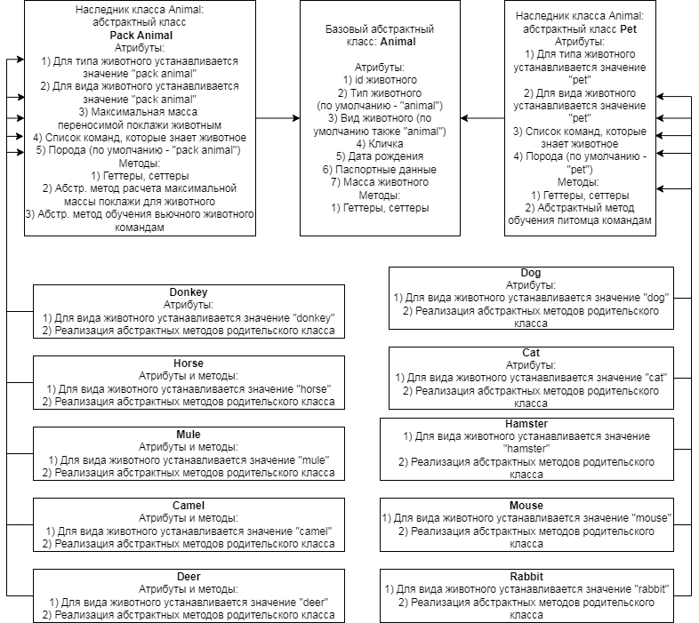

Мною была создана следующая диаграмма классов. В первую очередь это схема применима к понятию ООП и следующему заданию по созданию приложения на языке Java.
На ее основе будет создаваться и структурироваться база данных в следующих заданиях (с 7 по 12). Однако на данном этапе будут использованы не все атрибуты из диаграммы
для классов животных, а только id (имеется ввиду  уникальный id животного среди всех в питомнике),  тип,  вид, кличка, дата рождения животного, его команды. 
Все они будут присутствовать в высокоуровневой (итоговой) таблице взадании 12.Также для наполнения базы данных не будем учитывать классы Mule, Deer, Rabbit, Mouse. 

Для работы с базами данных использовался сервер **MySQL 8.0**.


## Задания 7, 8, 9

- **В подключенном MySQL репозитории создать базу данных “Друзья
человека”**
- **Создать таблицы с иерархией из диаграммы в БД**
- **Заполнить низкоуровневые таблицы именами(животных), командами, которые они выполняют и датами рождения**

Для выполнения этих заданий напишем sql-скрипт, а затем будем использовать его содержимое для наполнения БД.

*Для данного блока заданий внутри директории 3-mysql_tasks/ создадим директорию task7_8_9/.*

Для начала создадим отдельные таблицы для каждого вида животных. Заранее подумаем об атрибутах и наполнении таблиц. В низкоуровневой таблице 
будут атрибуты кличка, дата рождения животного, его команды (а также id для идентификации в пределах конкретной таблицы).  

Создадим в рабочей директории (*3-mysql_tasks/task7_8_9*)  текстовые файлы с наполнением для таблиц: 

- cats.txt,
- dogs.txt,
- hamsters.txt,
- donkeys.txt,
- horses.txt,
- camels.txt

В каждом из них, как например в camels.txt, будут содержаться строки вида:

```
("Sand Bump", "2022-12-22", "Лежать; Подъем; Бежать галопом; Стой"),
("Bongo", "2020-01-02", "Лежать; Подъем; Бежать галопом; Стой"),
("Han", "2021-09-24", "Лежать; Подъем; Бежать галопом; Стой"),
("Dona", "2020-01-08", "Лежать; Подъем; Бежать галопом; Стой")
```

После этого создадим в рабочей директории файл **task7_8_9.sql**, в котором будет храниться sql код. Поместим в него следующие запросы:

```
-- DROP DATABASE human_friends;
CREATE DATABASE human_friends;
USE human_friends;
```

Далее напишем небольшой скрипт в файл *script.sh* и запустим его командной строке (предварительно выделив для этого файла право на выполнение):

```
#!/bin/bash
file_result=task7_8_9.sql;
for table_name in $(ls *txt | grep -o -e "^[A-Za-z]*"); do
    echo -e "CREATE TABLE $table_name (\n\tid SERIAL PRIMARY KEY,\n\tanimal_name VARCHAR(30) NOT NULL,\n\tbirth_date DATE DEFAULT (CURRENT_DATE),\n\tcommands TEXT\n\t);\n" >> $file_result;
    echo -e "INSERT INTO $table_name (animal_name, birth_date, commands)\nVALUES" >> $file_result;
    echo -e "$(cat $table_name.txt);\n\n" >> $file_result;
done;
exit
```

В результате выполнения данного скрипта файл task7\_8\_9.sql заполняется запросами на создание низкоуровневых таблиц с их дальнейшим наполнением 
(см даннй файл в директории 3-mysql\_tasks/task7\_8\_9)

Теперь в терминале выполним команду:
```
mysql –u root –p < task7_8_9.sql #вводим пароль по приглашению системы
```

В результате СУБД выполнит все запросы, которые были записаны в этот файл.
Зайдем в СУБД и проверим результат работы:

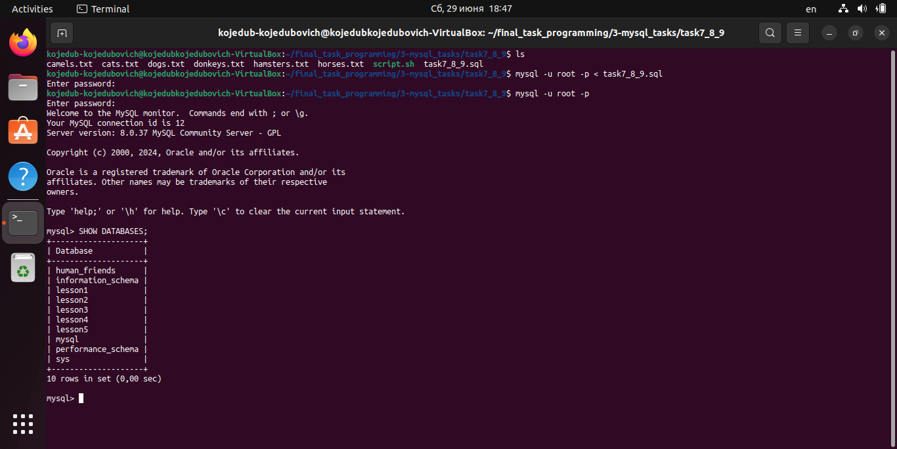

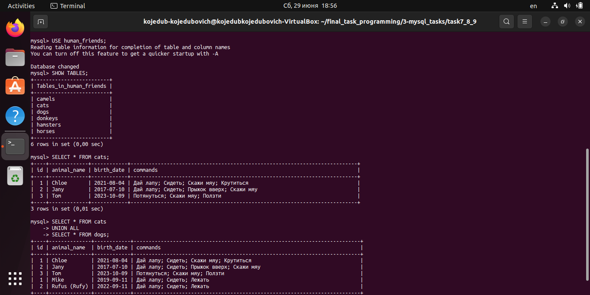

Теперь создадим среднеуровневые таблицы pack\_animals и pet\_animals, которые будут содержать дополнительный атрибут - тип животного. 
Остальные же атрибуты будут такими же, что и в низкоуровневых таблицах.  Пожалуй, одним из самых оптимальных вариантов будет создание новой таблицы через 
ключевое слово LIKE на основе одной из таблиц для животных, а затем добавление нового атрибута в таблицу. 
Запрос на создание таблицы pack\_animals будет выглядеть таким образом:
```
CREATE TABLE pack_animals LIKE camels;
ALTER TABLE pack_animals
ADD COLUMN animal_kind VARCHAR(30) NOT NULL AFTER animal_name;
INSERT INTO pack_animals (animal_name, animal_kind, birth_date, commands)
(SELECT animal_name, 'camel' AS animal_kind, birth_date, commands FROM camels
UNION
SELECT animal_name, 'horse' AS animal_kind, birth_date, commands FROM horses
UNION
SELECT animal_name, 'donkey' AS animal_kind, birth_date, commands FROM donkeys);
```

Аналогичным образом будет выглядеть запрос для pet\_animals. Запишем оба запроса в файл **task7_8_9_part2.sql** и запустим его на выполнение в СУБД  (см данный файл в директории 3-mysql\_tasks/task7\_8\_9):

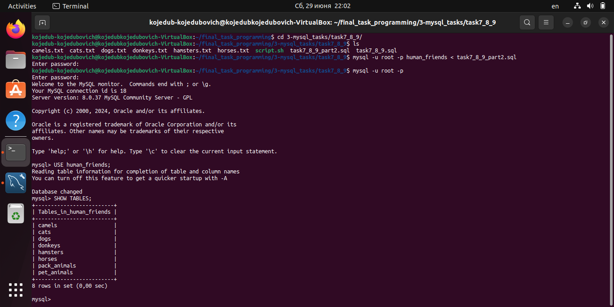

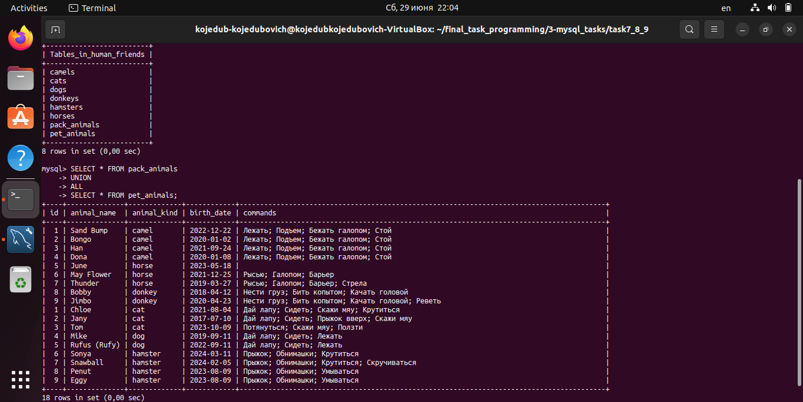

На данном этапе можно при необходимости удалить низкоуровневые таблицы. В следующих заданиях будем работать с таблицами pet\_animals и pack\_animals.


## Задания 10, 11, 12

- **Удалить из таблицы верблюдов, т.к. верблюдов решили перевезти в другой
питомник на зимовку. Объединить таблицы лошади, и ослы в одну таблицу.**
- **Создать новую таблицу “молодые животные” в которую попадут все животные старше 1 года, но младше 3 лет и в отдельном столбце с точностью 
до месяца подсчитать возраст животных в новой таблице**
- **Объединить все таблицы в одну, при этом сохраняя поля, указывающие на
прошлую принадлежность к старым таблицам.**

*Для данного блока заданий внутри директории 3-mysql_tasks создадим директорию task10_11_12.*

Чтобы вывести животных определенной возрастной группы (старше 1 года, но младше 3 лет), создадим 2 процедуры в текущей БД, при вызове которых будет выполняться данная выборка.
Первая процедура будет основываться на работе функции TIMESTAMPDIFF(), а вторая будет на основе расчета и применения функции FLOOR(), возвращающей целую часть числа.

```
DROP PROCEDURE IF EXISTS find_young_animals;
DELIMITER //
CREATE PROCEDURE find_young_animals()
BEGIN
    SELECT
        animal_name,
        animal_kind,
        birth_date,
        age_months
    FROM
    (SELECT animal_name, animal_kind, birth_date, TIMESTAMPDIFF(month, birth_date, CURDATE()) AS age_months FROM pack_animals AS packs
    UNION
    SELECT animal_name, animal_kind, birth_date, TIMESTAMPDIFF(month, birth_date, CURDATE()) AS age_months FROM pet_animals AS pets) AS res
    WHERE age_months > 12 AND age_months < 36
    ORDER BY age_months;
END//
DELIMITER ;
-- CALL find_young_animals();
```

```
DROP PROCEDURE IF EXISTS find_young_animals_manual;
DELIMITER &&
CREATE PROCEDURE find_young_animals_manual()
BEGIN
    SELECT
        animal_name,
        animal_kind,
        birth_date,
        age_months
    FROM
    (SELECT animal_name, animal_kind, birth_date, FLOOR(DATEDIFF(CURDATE(), birth_date)/30.4375) AS age_months FROM pack_animals AS packs
    UNION
    SELECT animal_name, animal_kind, birth_date, FLOOR(DATEDIFF(CURDATE(), birth_date)/30.4375) AS age_months FROM pet_animals AS pets) AS res
    WHERE age_months > 12 AND age_months < 36
    ORDER BY age_months;
END&&
DELIMITER ;
-- CALL find_young_animals_manual();
```

*Примечание. Среднее количество дней в месяце равно за 4 года:*
*(365\*4+1)/(12\*4)=30.4375*

В рабочей директории (3-mysql\_tasks/task10\_11\_12) создадим файл **task10_11_12_proc.sql** и поместим в него эти два запроса на создание процедур. Запустим его на выполнение в СУБД и проверим результат работы этих процедур:

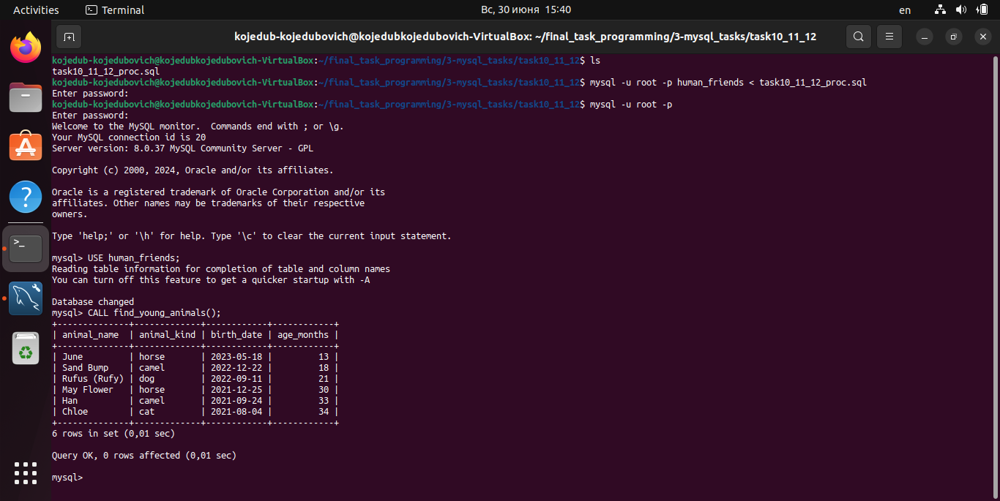

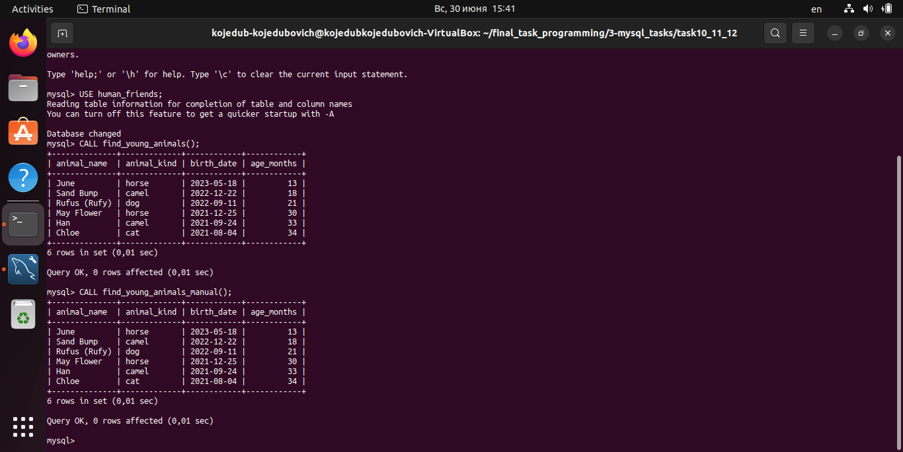

Как видно, обе процедуры дали одинаковый результат.

Теперь удалим все записи о верблюдах из таблицы pack\_animals:
```
-- SET SQL_SAFE_UPDATES = 0;
DELETE FROM pack_animals WHERE animal_kind = "camel";
```
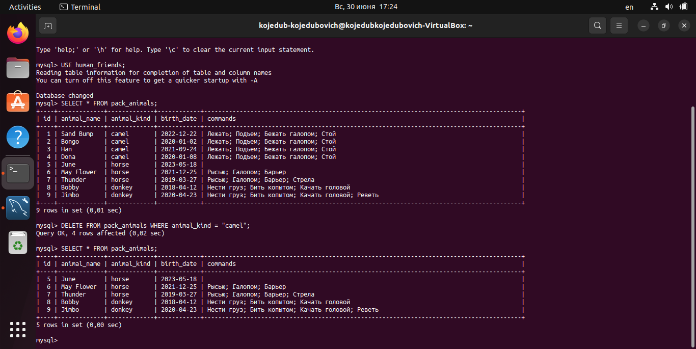

Мы не стали удалять таблицу camels, произведем удаление и в ней с помощью команды TRUNCATE:

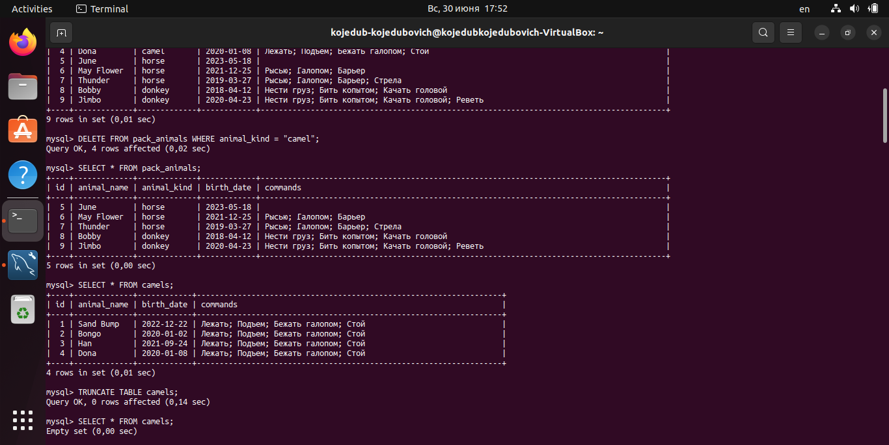

Объединим таблицы pack\_animals и pet\_animals в одну таблицу – all\_animals:
```
CREATE TABLE all_animals LIKE pet_animals;
ALTER TABLE all_animals
ADD COLUMN animal_type VARCHAR(30) NOT NULL AFTER animal_name;
INSERT INTO all_animals (animal_name,animal_type, animal_kind, birth_date, commands)
(SELECT animal_name, 'pack_animal' AS animal_type, animal_kind, birth_date, commands FROM pack_animals AS packs
UNION
SELECT animal_name, 'pet_animal' AS animal_type, animal_kind, birth_date, commands FROM pet_animals AS pets);
```

Запишем запрос на объединение таблиц в файл **task10_11_12_part2.sql** и направим на исполнение в СУБД. В этот же файл поместим предыдущие запросы на удаление записей о верблюдах для отчета, закомментировав их.

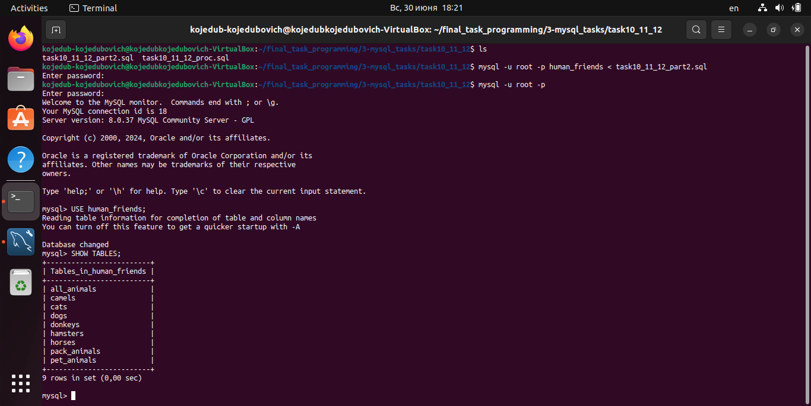

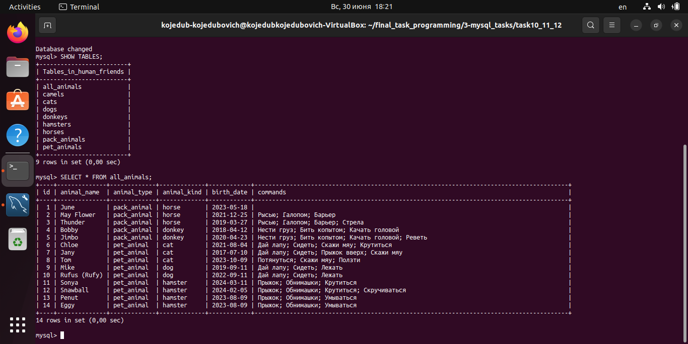
