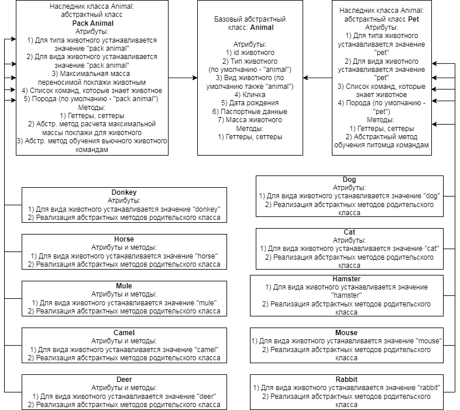
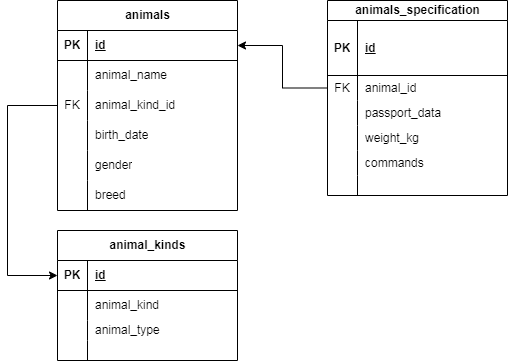

##Вступление

Для выполнения заданий 13-15 воспользуемся составленной ранее диаграммой классов. Работать будет в директории *4-Java_OOP_tasks/*
Приложение, целью которого является реализация ведения учета животных в питомнике, будем реализовывать на языке Java. Записи о животных 
будут храниться в базе данных на сервере mysql на локальной машине. Для связи приложения с mysql будем использовать модуль JDBC. 

##Подготовка базы данных для приложения

База данных была существенно расширена и реструктурирована по сравнению с той, что получилась в конце предыдущего задания.
Структурно база разбита на 3 таблицы. 

- Основная - animals;
- Дополнительная - animals\_specification;
- Используемая для отражения классификации животных - animal\_kinds.

По задумке в основной таблице будут размещаться данные, к которым будут обращаться наиболее часто. В дополнительную таблицу соответственно будут отправляться данные,
пользующиеся не таким частым спросом. И хотя в данном случае количество атрибутов не такое уж и большое, их даже можно было бы поместить все в одну общую таблицу, но все-таки
система вполне может начать расширяться. Допустим нам будет необходимо добавить новые атрибуты, отражающие размеры животного, это как минимум 3 атрибута - длина, ширина и высота,
а для птиц еще, возможно, и размах крыльев. Эти данные явно не будут пользоваться частым спросом, однако будут необходимы для просмотра в случае транспортировки животных. 
Поэтому имеет смысл сделать сразу отдельную таблицу с дополнительными артибутами. 

По условиям задания нам необходимо орагнизовать деление животных на типы - вьючные и домашние (в будущем могут появиться и птицы). Для этого очень удобно создать
таблицу с видами животых (собаки, кошки, лошади и т.д.) и каждому виду присвоить соответствующий тип. Также в эту таблицу можно при необходимости
добавить и новые атрибуты (колонки), отражающие деление животных на подтипы, но уже в другой классфикации, например, по типу питания.

Создадим директорию *create_new_db/*, в нее поместим файл **create_animal_house_db.sql**. Внутрь него поместим все запросы по созданию базы данных animal\_house и ее наполнению.
Ознакомиться с файлом можно в репозитории. Запустим файл на исполнение в СУБД. 

Создадим нового пользователя mysql на сервере и дадим ему все права доступа на только что созданную базу animal\_house. Параметры этого пользователя нам пригодятся 
в дальнейшем при подключении java-приложения к серверу mysql на локальной машине. 

