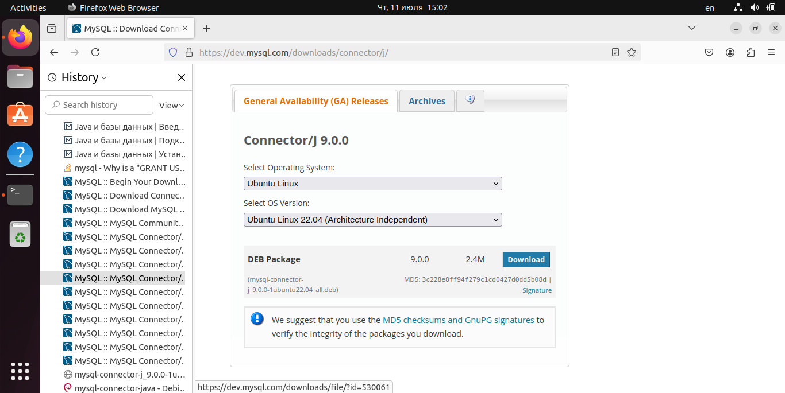
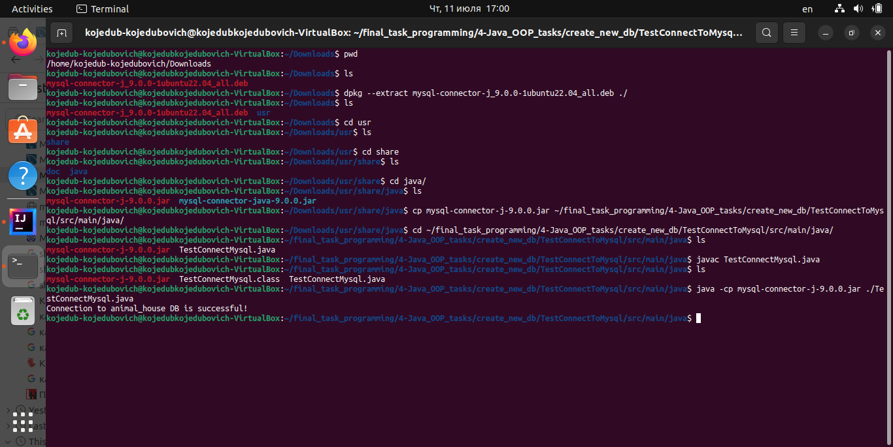

## Вступление

Для выполнения заданий 13-15 воспользуемся составленной ранее диаграммой классов. 


Работать над этими заданиями будем в директории *4-Java_OOP_tasks/*

Приложение, целью которого является реализация ведения учета животных в питомнике, будем реализовывать на языке Java. Записи о животных 
будут храниться в базе данных на сервере mysql на локальной машине. Для связи приложения с mysql будем использовать модуль JDBC. 

При составления приложения была использована информация со следующих ресурсов:

- https://metanit.com/java/database/
- https://ru.hexlet.io/qna/java/questions/kak-podklyuchit-mysql-k-java
- https://dev.mysql.com/doc/connector-j/en/
- https://selectel.ru/blog/tutorials/how-to-create-a-new-user-and-set-privileges-in-mysql/

## Подготовка базы данных для приложения

База данных для будущего приложения была существенно расширена и реструктурирована по сравнению с той, что получилась в конце предыдущего задания.
Структурно база разбита на 3 таблицы: 

- Основная - animals;
- Дополнительная - animals\_specification;
- Используемая для отражения классификации животных - animal\_kinds.


По задумке в основной таблице будут размещаться данные, к которым будут обращаться наиболее часто. В дополнительную таблицу соответственно будут отправляться данные,
пользующиеся не таким частым спросом. И хотя в данном случае количество атрибутов не такое уж и большое, их даже можно было бы поместить все в одну общую таблицу, но все-таки
система вполне может начать расширяться. Допустим нам будет необходимо добавить новые атрибуты, отражающие размеры животного, это как минимум 3 атрибута - длина, ширина и высота,
а для птиц еще, возможно, и размах крыльев. Эти данные явно не будут пользоваться частым спросом, однако будут необходимы для просмотра в случае транспортировки животных. 
Поэтому имеет смысл сделать сразу отдельную таблицу с дополнительными артибутами. 

По условиям задания нам необходимо организовать деление животных на типы - вьючные и домашние (в будущем могут появиться и птицы). Для этого очень удобно создать
таблицу с видами животых (собаки, кошки, лошади и т.д.) и каждому виду присвоить соответствующий тип. Также в эту таблицу можно при необходимости
добавить и новые атрибуты (колонки), отражающие деление животных на подтипы, но уже в другой классфикации, например, по типу питания.

Создадим директорию *create_new_db/* и в ней создаим файл **create_animal_house_db.sql**. Внутрь него поместим все запросы по созданию базы данных animal\_house и ее наполнению.
Ознакомиться с файлом можно в репозитории. Запустим файл на исполнение в СУБД. 

Создадим нового пользователя mysql на сервере и дадим ему все права доступа на только что созданную базу animal\_house. Параметры этого пользователя нам пригодятся 
в дальнейшем при подключении java-приложения к серверу mysql на локальной машине. Для этого выполним следующие команды в СУБД:

```
CREATE USER "animal_guru_111"@"localhost" IDENTIFIED BY "secretword_554326";
GRANT ALL ON `animal_house`.* TO "animal_guru_111"@"localhost";
```


Комнады, которые были использованы при создании нового пользователя, занесем в файл **create_new_db/create_user.sql** 

Создадим тестовый java-проект для подключения к СУБД с параметрами созданного пользователя. Он будет размещен в дирктории *4-Java_OOP_tasks/create_new_db/TestConnectToMysql*

```
import java.sql.*;

public class TestConnectMysql {
    public static void main(String[] args) {

        String url = "jdbc:mysql://localhost:3306/animal_house";
        String user = "animal_guru_111";
        String password = "secretword_554326";

        try (Connection conn = DriverManager.getConnection(url, user, password)) {
            System.out.println("Connection to animal_house DB is successful!");
        } catch (SQLException e) {
            System.out.println("Connection is failed...");
            System.out.println("Error: " + e.getMessage());
        }
    }

}
```
Для подключения к СУБД mysql нам понадобится mysql-connector-j. Для этого скачиваем с сайта-разработчика deb-пакет. 



Далее необходимо будет распаковать deb-пакет и найти в нем файл mysql-connector-j-version.jar

После этого для удобства копируем этот файл в директорию, где располагается главный java-файл нашего проекта. Перейдем в эту директорию.
А дальше запускаем наше тестовое приложение из терминала, указав путь к jar-файлу используемого коннектора в команде:

```
java -cp mysql-connector-j-9.0.0.jar ./TestConnectMysql.java
```



В данном случае можно после -cp просто указать название jar-файла, т.к. он расположени в текущей директории.
